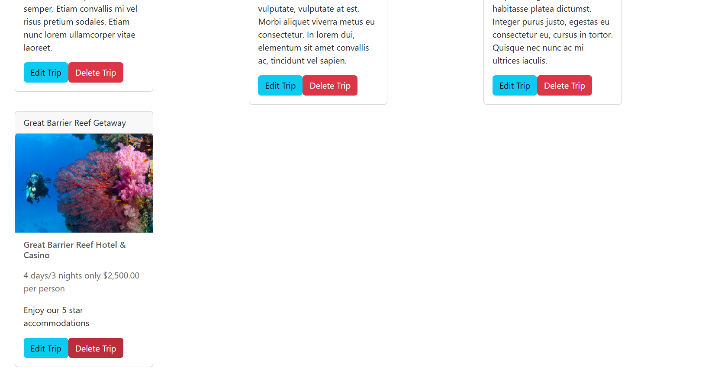
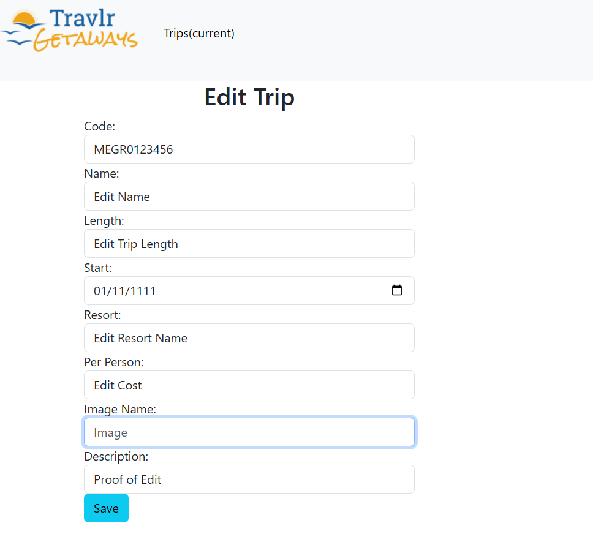
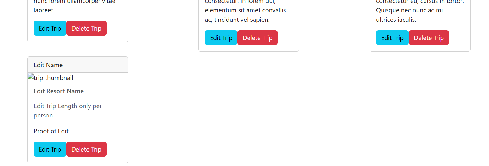
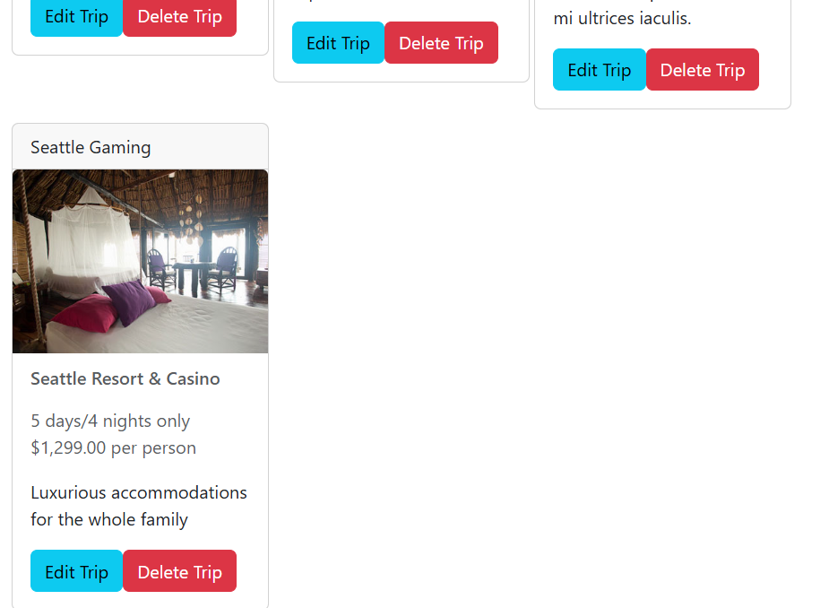
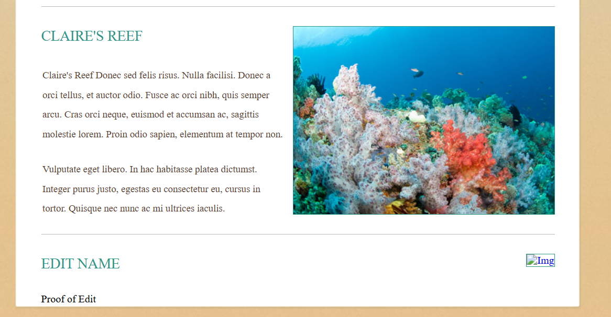
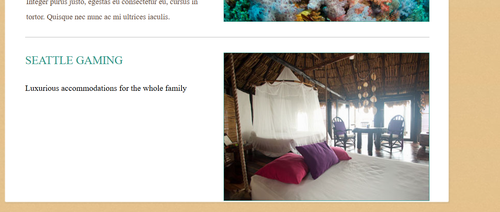

# Travlr-Getaways - Full-Stack MEAN Web Application
A web application built with a focus on developing front-end user interface and a back-end administrator interface connected through MongoDB.  

## Table of Contents
- [Overview](#overview)
- [Technologies](#technologies)
- [Features](#features)
- [Skills/Concepts](#skills-&-concepts)
- [Example Evidence](#examples)

[Back to e-Portfolio](https://github.com/AnthonyBaratti/AnthonyBaratti.github.io)

## Overview
- Full-stack web application demonstrating integration between frontend UI, backend API, and database
- Provides a real-world example of managing dynamic content instead of relying on static web pages
- Includes an authenticated admin interface for securely managing travel listings
- Demonstrates how backend changes immediately reflect in the user-facing frontend
- Showcases practical implementation of REST APIs, authentication, and persistent data storage
- Showcases use of professional development tools such as MongoDB Compass, Postman, and Github

## Technologies
- Node.js for server-side runtime
- Express.js for backend routing and API development
- MongodDB for data persistence
- Mongoose for schema modeling and database interaction
- Angular for the admin single-page application (SPA)
- HTML, CSS, and JavaScript for client-facing UI
- JSON Web Tokens (JWT) for authentication and protected routes
- Postman for API testing and validation
- MongoDB Compass for database inspection and verification
- Git and GitHub for version control and project management

## Features
- RESTful API supporting full CRUD operations (Create, Read, Update, Delete)
- Secure authentication system using JWT
- Protected API routes that require valid tokens
- Angular-based admin dsashboard for managing travel listings
- Dynamic front-end updates reflecting backend data changes
- Persistant storage using MongoDB
- Separation of concerns across frontend, API, and database layers
- Environment-based configuration using .env for security

## Skills & Concepts
- Ability to design and implement a full-stack architecture
- Understanding of backend API design and routing
- Experience working with databases and schema models
- Knowledge of authentication and secure application practices
- Ability to debug real-world issues (environment variables, Node errors, dependency conflicts, etc)
- Comfort working with professional developer tools
- Ability to connect multiple systems (frontend, backend, database) into a cohesive application

## Examples
### Administrator Backend
#### Admin Dashboard
This screen shot shows the Admin dashboard after an admin user is authenticated through the login screen.  
 

#### Admin Edit Trip
This screen shot shows the admin edit trip form, accessed through the edit button on the trip card.

#### Admin Edit Trip Evidence
This screen shot shows the edited trip card (updated after trip form is saved).

#### Admin Add Trip
This screen shot shows the admin add trip form, accessed through the Add Trip button.

#### Admin Add Trip Evidence
This screen shot shows that the trip was added to the admin page.

### User Interface Frontend

#### Frontend Trip Edit
This screen shot shows an edit on the trip card "Great Barrier Reef Resort and Casino". Replaced simply by the title, Proof of Edit.

#### Frontend Trip Deleted
This screenshot shows the 4th trip down (Edited trip, below Claire's Reef) has been deleted from the backend Delete Button.

#### Frontend Trip Added
This screenshot shows that a new trip was added from the admin backend Trip Form to the frontend UI.

  
[Back to Contents](#table-of-contents)
